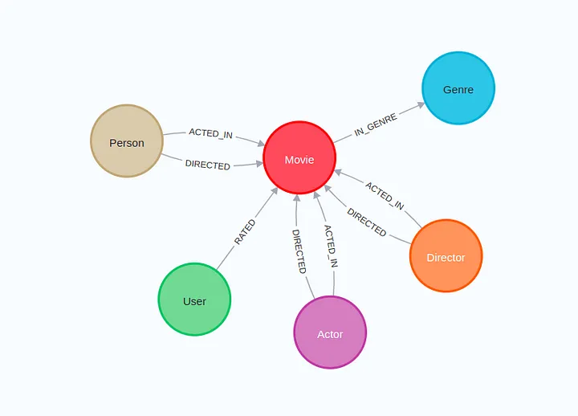
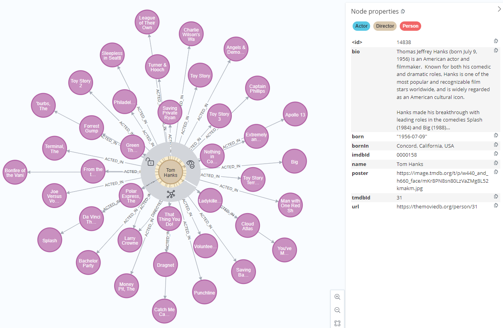
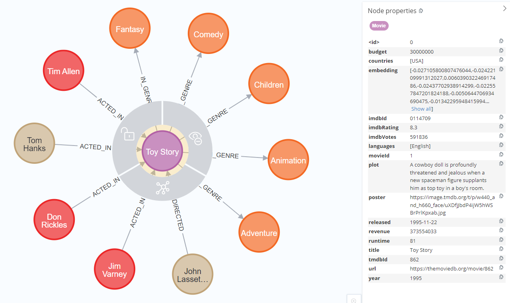

# Build an Neo4j-backed Chatbot using Python

## Description

This is a repository for a Movie Chatbot backed by neo4j graph database

For a complete walkthrough of this repository, [enrol now](https://graphacademy.neo4j.com/courses/llm-chatbot-python/?ref=github)

If you are entirely new to `OpenAI`, `LangChain`, and `Neo4j`, I recommend exploring the learning resources here.

|OpenAI| LangChain | Neo4j |
|------|-----------|-------|
| [ChatGPT Prompt Engineering for Developers](https://www.deeplearning.ai/short-courses/chatgpt-prompt-engineering-for-developers/)| [LangChain for LLM Application Development](https://www.deeplearning.ai/short-courses/langchain-for-llm-application-development/) | [Neo4j Fundamentals](https://graphacademy.neo4j.com/courses/neo4j-fundamentals/) |
|[Building Systems with the ChatGPT API](https://www.deeplearning.ai/short-courses/building-systems-with-chatgpt/)| [LangChain: Chat with Your Data](https://www.deeplearning.ai/short-courses/langchain-chat-with-your-data/) | [Cypher Fundamentals](https://graphacademy.neo4j.com/courses/cypher-fundamentals/) |
|| [Functions, Tools and Agents with LangChain ](https://www.deeplearning.ai/short-courses/functions-tools-agents-langchain/)| [Graph Data Modeling Fundamentals](https://graphacademy.neo4j.com/courses/modeling-fundamentals/) |
|| | [Importing CSV data into Neo4j](https://graphacademy.neo4j.com/courses/importing-cypher/) |

## Agent Tools List

- **General Chat**
  - *Description*: For general chat not covered by other tools
  - *Function*: `llm.invoke`
  - *Discription*: This is the base LLM, Please note, the LLM is instructed to only respond to queries related to movies or actors.


- **Vector Search Index**
  - *Description*: Provides information about movie plots using Vector Search
  - *Function*: `run_retriever`
  - *Discription*: This will be triggered when a user asks a question related to movies or plots, for example, `Can you suggest some movies about aliens attacking Earth?`. The prompt also guides the LLM to present movie details in a specific format.


- **Graph Cypher QA Chain**
  - *Description*: Provides information about Movies including their Actors, Directors and User reviews
  - *Function*: `run_cypher`
  - *Discription*: This will be triggered when a user asks a question related to the Movie Graph Database, for example, `In which movies have Tom Hanks and Meg Ryan acted together?`

## Installation

To run the application, you must install the libraries listed in `requirements.txt`.
```bash
pip install -r requirements.txt
```
## Running the application

Then run the `streamlit run` command to start the app on [http://localhost:8501/](http://localhost:8501/)

```bash
streamlit run bot.py
```

## To setup Neo4j Sandbox account
Follow instruction on [neo4j sandbox](https://neo4j.com/sandbox/)

## Database Schema

```Cypher
call db.schema.visualization()
```



## Cyphe Query Examples

Movies by `Tom Hanks`
```Cypher
MATCH (p:Person)--(m:Movie) WHERE p.name='Tom Hanks' RETURN p,m 
```



Details about `Toy Story`
```Cypher
MATCH (p:Person)--(m:Movie)--(g:Genre) WHERE m.title='Toy Story' RETURN p,m,g
```

